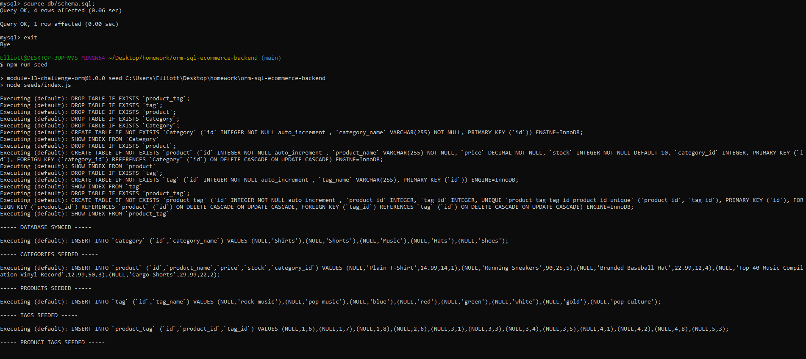
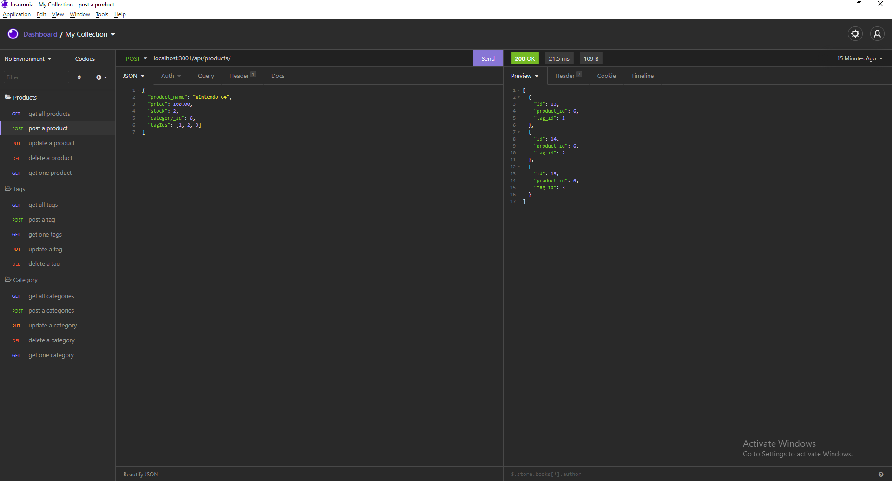
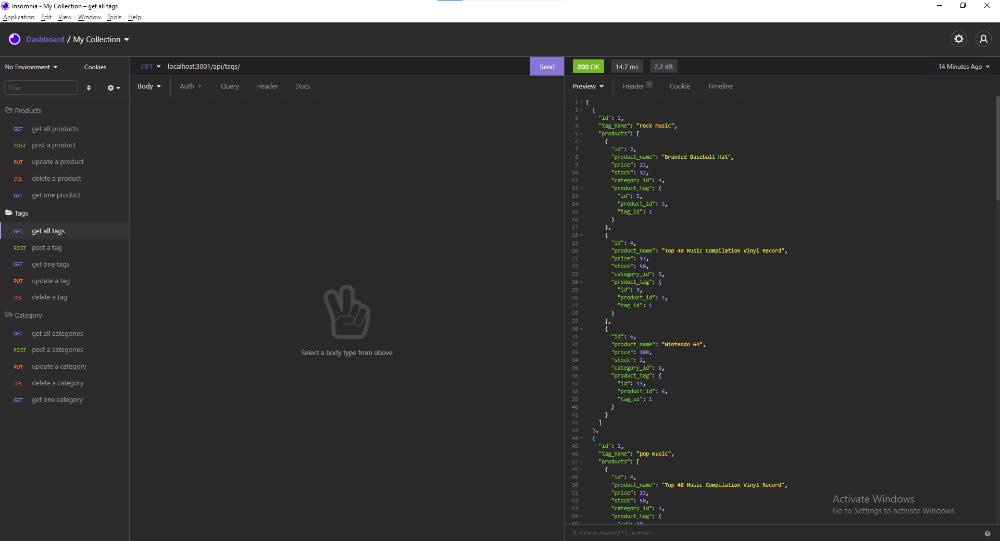

# E-COMMERCE BACKEND

## This program is a back-end, command-line application to manage an E-commerce site's products, tags, and categories.

```md
AS THE Manager of an E-Commerce website, I want to view the products and their coresponding tags, prices, and stock in my database.
WHEN I run the commands provided in the Installation section, 
THEN I am provided with a confirmation message that my Database has been selected, my seeds have been populated, and my website is running on a local server.
WHEN I enter a respective API route in Insomnia, 
THEN I am provided with the coresponding information, and I am able to update, delete, and add to that information respectively.
```


## INSTALLATION

### To install this application, from your command line in this project's local directory, take the following steps-
* Run "SOURCE db/schema.sql;" from your MySQL shell.
* After exiting the MySQL shell, run "npm run seed" in the command line to populate your seeds in the database.
* Then, run "npm run start" to initialize a local server to update and view your application from.

### Please reference the screenshots and video provided below.





---

https://drive.google.com/file/d/1cxqyLEMC7wP87hqADJxqWYGc4uNxxpGZ/view

---

## TECHNOLOGY USED

### This application was built with JavaScript, MySQL, and tested in Insomnia.


